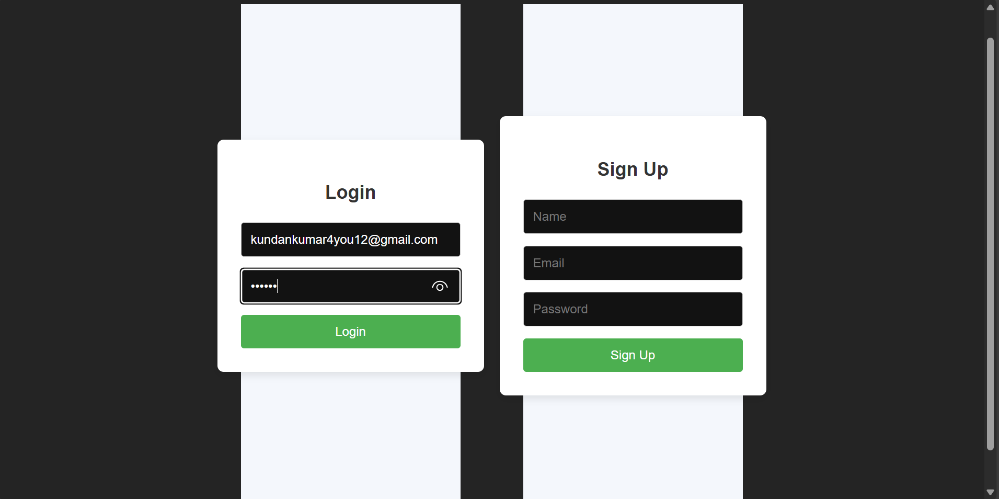
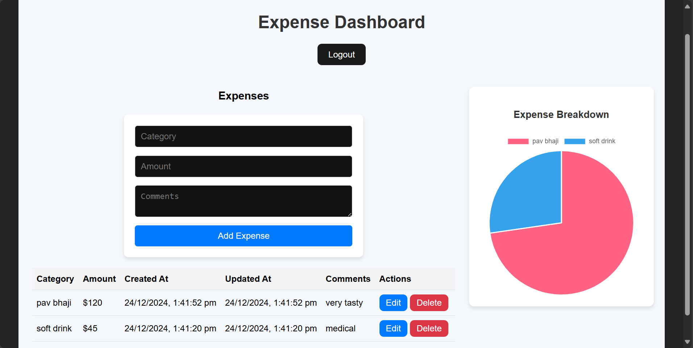

# Expense Management Application

## Overview

This **Expense Management Application** allows users to track their expenses by categorizing them, adding comments, and viewing a table of all their recorded expenses. Users can also update and delete their expenses, and the application automatically sorts the expenses by the most recently added records.

## Features

- **Add Expense**: Users can add new expenses with details such as category, amount, comments, and timestamps.
- **View Expenses**: View a table listing all recorded expenses with columns for Category, Amount, Created At, Updated At, and Comments.
- **Edit Expenses**: Users can update the details of an existing expense.
- **Delete Expenses**: Users can remove any expense record.
- **Responsive Design**: The application is mobile-friendly and adjusts to different screen sizes.

## Technologies Used

- **React**: Frontend JavaScript library for building user interfaces.
- **Node.js**: Backend runtime environment.
- **MongoDB**: Database for storing expense records.
- **Axios**: HTTP client for making requests to the backend API.
- **CSS**: Custom styles for a modern, clean UI.

## Getting Started

Follow these steps to set up and run the project locally.

### 1. Clone the repository

```bash
git clone https://github.com/your-username/expense-management-app.git
```

### Install dependencies
Frontend:
```bash
cd Frontend
npm install
```
Backend:
```bash
cd Backend
npm install
```

Start the development server

Backend
```bash
npm run start
```
Frontend
```bash
npm run dev
```

## Functionality

- Expense Creation: Add a new expense with details like category, amount, and comments.

- Expense Listing: View a sorted list of all expenses with detailed information such as category, amount, and timestamps.
- Expense Edit: Modify the details of an existing expense.
- Expense Deletion: Delete expenses from the list permanently.
Responsive Design: The application adapts to different screen sizes for mobile and desktop use.

## Screenshot

Here’s a screenshot of the Expense Management Application in action:

### Login And SignUp Page
 

### DashBoard


# Happy Coding 🚀